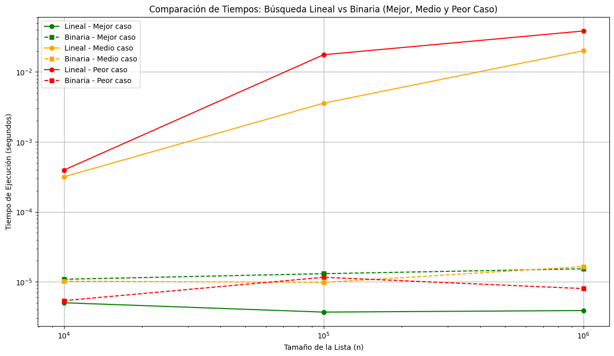

# 📊 Análisis de Algoritmos: Búsqueda Lineal vs Binaria

## 🎯 Objetivo

Demostrar comprensión de los conceptos fundamentales del análisis de algoritmos, la notación Big O, la complejidad temporal y espacial, y su aplicación práctica en Python mediante la comparación entre dos algoritmos de búsqueda: **lineal** y **binaria**.

---

## ⚙️ Algoritmos Implementados

### 🔍 Búsqueda Lineal (`O(n)`)
Recorre la lista secuencialmente hasta encontrar el objetivo. Su rendimiento depende directamente del tamaño de la lista y de la posición del valor buscado.

### 🔎 Búsqueda Binaria (`O(log n)`)
Funciona solo en listas ordenadas. Divide la lista a la mitad en cada paso, reduciendo drásticamente el número de comparaciones necesarias.

---

## 🧠 Notación Big O

La notación Big O permite describir el **crecimiento del tiempo de ejecución** en función del tamaño de la entrada:

- **O(n)**: crece linealmente → búsqueda lineal.
- **O(log n)**: crece logarítmicamente → búsqueda binaria.

---

## Justificación de los algoritmos elegidos
Se eligieron búsqueda lineal y búsqueda binaria por ser dos algoritmos clásicos, sencillos y ampliamente utilizados, con complejidades contrastantes:

- La **búsqueda lineal** tiene una complejidad de O(n), ya que en el peor caso recorre todos los elementos de la lista.

- La **búsqueda binaria**, por el contrario, tiene una complejidad de O(log n), ya que divide el espacio de búsqueda en mitades sucesivas.

Estos algoritmos permiten observar de forma clara cómo la eficiencia algorítmica cambia dependiendo del enfoque y del tipo de estructura de datos (por ejemplo, si la lista está ordenada o no). Además, su implementación es simple, lo que los hace ideales para fines educativos y comparativos.

---

## 🧪 Metodología

1. Se generaron listas ordenadas de tamaños `10⁴`, `10⁵` y `10⁶`.
2. Se realizaron búsquedas en tres escenarios:
   - **Mejor caso**: el objetivo está al inicio.
   - **Caso medio**: el objetivo está en el centro.
   - **Peor caso**: el objetivo está al final.
3. Se midió el tiempo de ejecución de cada algoritmo con el módulo `timeit`.
4. Se graficaron los resultados con `matplotlib` usando escala logarítmica en ambos ejes.

---

## 📈 Resultados Obtenidos

### 🔍 Búsqueda Lineal (O(n))

- **Peor caso (línea roja):** tiempo crece linealmente; el objetivo está al final de la lista.
- **Caso medio (naranja):** tiempo medio; el objetivo está a mitad de lista.
- **Mejor caso (verde):** tiempo constante; el objetivo está al inicio. Esto representa que el valor fue encontrado en la primera posición: una sola comparación, por eso es el caso más rápido.

> 📌 La búsqueda lineal es sensible a la posición del elemento y no escala bien con listas grandes y se vuelve ineficiente.
### 🔎 Búsqueda Binaria (O(log n))

- Todas las líneas (verde, naranja, roja) son similares y cercanas al eje horizontal.
- Demuestra rendimiento constante sin importar la posición del objetivo.

> 📌 La búsqueda binaria es ideal para listas ordenadas, siendo muy rápida incluso en el peor caso.

---

## 📊 Comparación General

| Característica           | Búsqueda Lineal       | Búsqueda Binaria     |
|--------------------------|------------------------|-----------------------|
| Complejidad temporal     | O(n)                  | O(log n)              |
| Requiere orden previo    | ❌ No                 | ✅ Sí                 |
| Varía por posición       | ✅ Sí                | ❌ No                |
| Escalabilidad            | ❌ Mala               | ✅ Excelente          |

---
      import timeit
      import matplotlib.pyplot as plt

      # -----------------------------
      # 1. Implementación de Funciones de Búsqueda
      # -----------------------------

      def busqueda_lineal(lista, objetivo):
          """
          Realiza una búsqueda lineal en la lista.
          Retorna el índice si encuentra el objetivo, o -1 si no lo encuentra.
          Complejidad temporal: O(n)
          """
          for i in range(len(lista)):
              if lista[i] == objetivo:
                  return i
          return -1

      def busqueda_binaria(lista, objetivo):
          """
          Realiza una búsqueda binaria en una lista ordenada.
          Retorna el índice si encuentra el objetivo, o -1 si no lo encuentra.
          Complejidad temporal: O(log n)
          """
          izquierda = 0
          derecha = len(lista) - 1

          while izquierda <= derecha:
              medio = (izquierda + derecha) // 2
              if lista[medio] == objetivo:
                  return medio
              elif lista[medio] < objetivo:
                  izquierda = medio + 1
              else:
                  derecha = medio - 1
          return -1

      # -----------------------------------------
      # 2. Generación de datos
      # -----------------------------------------

      tamaños = [10**4, 10**5, 10**6]
      listas = [list(range(t)) for t in tamaños]

      # Generar objetivos para cada tipo de caso
      objetivos = {
          "mejor":   [lista[0] for lista in listas],                # Primer elemento
          "medio":   [lista[len(lista)//2] for lista in listas],    # Elemento del medio
          "peor":    [lista[-1] for lista in listas]                # Último elemento
      }

      # -----------------------------------------
      # 3. Medición de tiempo para todos los casos
      # -----------------------------------------

      resultados = {
          "lineal": {"mejor": [], "medio": [], "peor": []},
          "binaria": {"mejor": [], "medio": [], "peor": []}
      }

      print(f"{'Caso':>6} | {'Tamaño':>10} | {'Lineal (s)':>12} | {'Binaria (s)':>12}")
      print("-" * 50)

      for caso in ["mejor", "medio", "peor"]:
          for i in range(len(tamaños)):
              lista = listas[i]
              objetivo = objetivos[caso][i]

              # Medir tiempos
              t_lineal = timeit.timeit(lambda: busqueda_lineal(lista, objetivo), number=1)
              t_binaria = timeit.timeit(lambda: busqueda_binaria(lista, objetivo), number=1)

              # Guardar resultados
              resultados["lineal"][caso].append(t_lineal)
              resultados["binaria"][caso].append(t_binaria)

              # Imprimir resultados
              print(f"{caso:>6} | {tamaños[i]:>10,} | {t_lineal:>12.6f} | {t_binaria:>12.6f}")

      # -----------------------------------------
      # 4. Gráfica comparativa
      # -----------------------------------------

      plt.figure(figsize=(12, 7))

      # Colores para cada caso
      colores = {
          "mejor": "green",
          "medio": "orange",
          "peor": "red"
      }   

      # Graficar cada caso para ambos algoritmos
      for caso in ["mejor", "medio", "peor"]:
          plt.plot(tamaños, resultados["lineal"][caso], marker='o',
                   linestyle='-', color=colores[caso],
                   label=f'Lineal - {caso.title()} caso')

          plt.plot(tamaños, resultados["binaria"][caso], marker='s',
                   linestyle='--', color=colores[caso],
                   label=f'Binaria - {caso.title()} caso')

      # Configuración de la gráfica
      plt.title("Comparación de Tiempos: Búsqueda Lineal vs Binaria (Mejor, Medio y Peor Caso)")
      plt.xlabel("Tamaño de la Lista (n)")
      plt.ylabel("Tiempo de Ejecución (segundos)")
      plt.xscale('log')
      plt.yscale('log')
      plt.grid(True)
      plt.legend()
      plt.tight_layout()
      plt.savefig("comparacion_todos_los_casos.png")
      plt.show()

---

## 🖼 Capturas de Pantalla

### 🧾 Código en el editor

### 📉 Salida y gráfica

---

## ✅ Conclusiones

- La búsqueda binaria demuestra una gran eficiencia en cualquier caso siempre que la lista esté ordenada.
- La búsqueda lineal es fácil de implementar y útil en listas pequeñas o desordenadas, pero su rendimiento se degrada rápidamente con el tamaño.
- Las diferencias de rendimiento, mostradas en escalas logarítmicas, confirman las predicciones teóricas de la notación Big O.

---

## 👨‍💻 Autor

**[Claudio Andrés Díaz Vargas]**  
[Análisis de Algoritmo y Notación Big O /
Módulo 2 - Clase N° 4]     
[Año: 2025]

---

